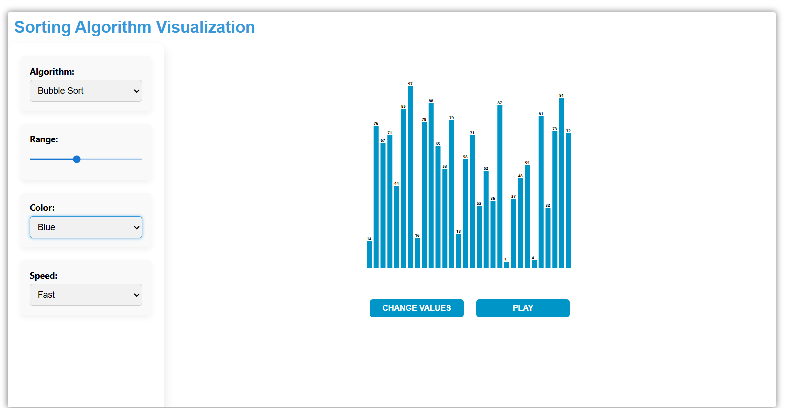

# This project will help you to visualize the comparision based sorting algorithm like:
1. Bubble Sort  
2. Selection Sort  
3. Merge Sort  
4. Insertion sort
5. Quick sort
# You can change the array values , array size  and the speed of the sorting visualization. 

